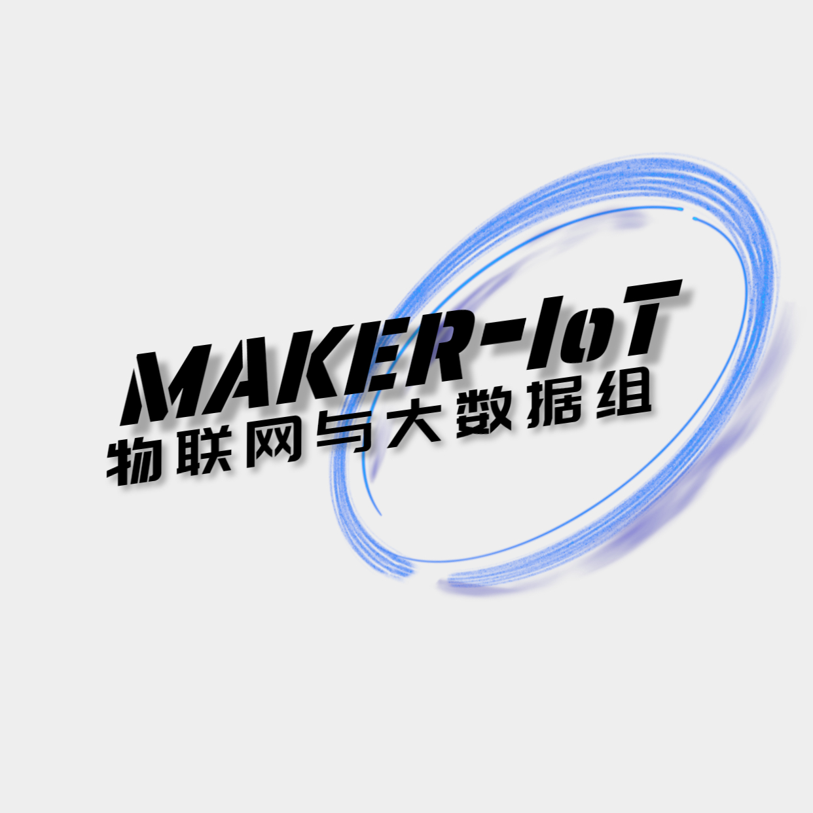

<h1 align="center" >🎉Maker-IoT🚀Atlas-200I-DK-A2🎉</h1>

  

    <strong>本仓库是梅科尔工作室IoT组成员们对昇腾的开发经验总结，教程更偏向昇腾的Linux系统的操作,旨在帮助大家更好地学习昇腾，欢迎大家加入我们的交流群（群号：469363175）</strong>
  

  

  
  
  
  
  
  

## 目录

- 一、Getting Started 环境搭建🚀🚀🚀
  - [1、Clash代理](./doc/network/clash.md)
  - [2、Zsh美化](./doc/terminal/zsh.md)
  - [3、Neovim](./doc/editor/neovim.md)
  - [4、Pytorch](./doc/deep_learning/pytorch/config.md)
  - [5、Mindspore](./doc/deep_learning/mindspore/config.md)
  - [6、OpenGauss](./doc/contribute/become_a_contributor.md)
  - [Finaly、环境搭建问题库🤡](./doc/questions/questions_one.md)
- 二、算法部署⚡⚡⚡
  - [1、Pytorch部署](./doc/deep_learning/pytorch/model_conversion.md)
  - [Finally、算法部署问题库](./doc/questions/questions_two.md)
- 三、深度学习之“推理代码”⚡⚡⚡
  - [1、何为“推理”？](./doc/deep_learning/explain.md)
  - [2、pytorch框架的“推理”](./doc/deep_learning/pytorch/pytorch_predict.md)
- 四、玩转昇腾硬件(Shell)✌🏼✌🏼✌🏼
  - [1、玩转GPIO](./doc/hardware/gpio.md)
  - [2、玩转串口](./doc/hardware/serial.md)
  - [3、玩转摄像头](./doc/hardware/camera.md)
  - [4、玩转音频](./doc/hardware/audio.md)
  - []
- 五、上下位机交互✨⭐🌟
  - [1、昇腾和小熊派串口通信](./doc/hardware/hi3861_serial.md)
  - [2、昇腾和小熊派网络socket通信](./doc/hardware/hi3861_network.md)
  - [3、玩转Arduino舵机案例](./doc/hardware/Arduino_servo.md)

- 六、昇腾与后端交互
  - [1、django项目使用openGauss数据库](./doc/database/django.md)

## 🎉参与贡献🎉

<!--  -->

<h3>本仓库隶属于梅科尔工作室IoT组</h3>

仓库的编写得到了梅科尔工作室IoT团队小伙伴们的积极参与，我们热切欢迎大家加入我们的交流群（群号：469363175），共同为这个仓库添砖加瓦，助力大家更好地开发昇腾，期待与您的合作开发！  

Thank you to all the people who already contributed to Maker-IoT!

### [如何参与贡献🥳](./doc/contribute/become_a_contributor.md)
>如果你对这个开源项目非常感兴趣，并且你发现了其中的Issue并有能力解决它们，或者发现了其他问题并希望参与改进，那么点击标题，将告诉你如何成为一个贡献者。
