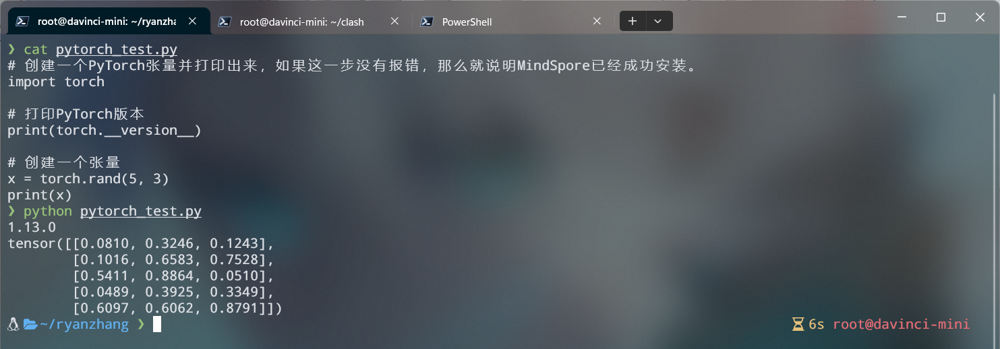
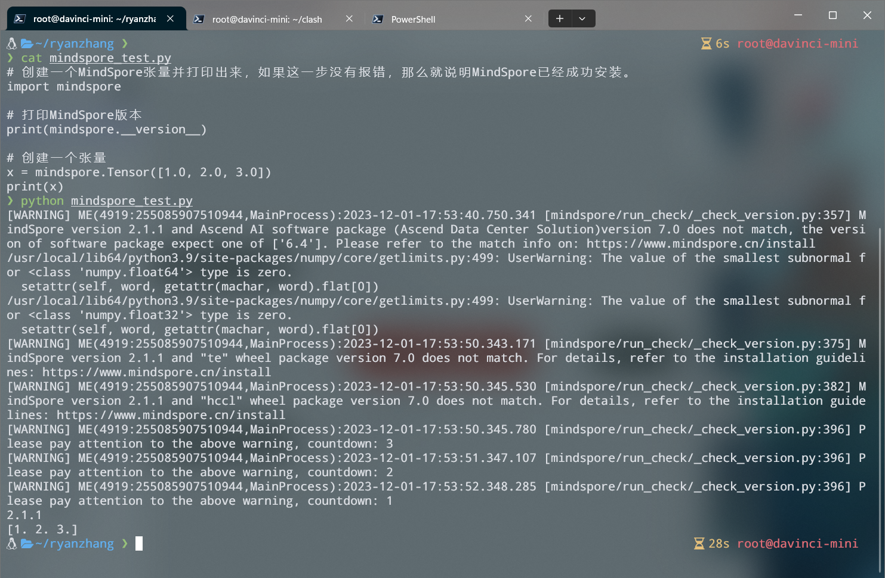
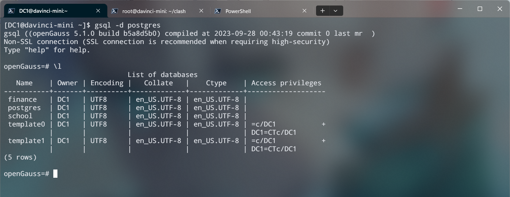

# Atlas-200I-DK-A2

点击进入官方文档：[官方文档](https://www.hiascend.com/document/detail/zh/Atlas200IDKA2DeveloperKit/23.0.RC2/lg/toctopics/topic_0000001698461113.html)

## 一、Getting Started 环境搭建
> 下面所有的配置都要在有代理的环境下进行，请务必完成这一步，不要跳步。
### 1、Clash代理🚀🚀🚀

<details><summary>🚀下载Clash内核</summary>

- 查看Linux系统版本

  ```sh
  hostname -a
  ```

- [选择对应的clash内核下载](https://www.clash.la/archives/755/)  (点击即可)

- 使用scp将内核文件复制到远程昇腾

  ```ash
  # 语法
  scp SourceFile user@host:directory/TargetFile

  # 示例
  scp ./clash-linux-amd64-v1.18.0.gz  root@10.10.0.2:/root
  ```

</details>
<details><summary>🚀启动Clash</summary>

- 在用户目录下创建 clash 文件夹

  ```
  cd && mkdir clash
  ```

- 移动并解压clash内核文件,并添加执行权限

  ```
  # 解压内核文件
  tar -xvf ./clash-linux-amd64-v1.18.0.gz

  # 重命名内核文件
  mv ./clash-linux-arm64 clash

  # 移动到clash执行文件到clash文件夹内
  mv ../root/clash ./clash
  ```

- 下载 Clash 配置文件

  ```
  # 这是个示例，请用自己的购买代理的url
  wget -O config.yaml "https://bl7gc.no-mad-world.club/link/EXxV5spf9gJDYri6?clash=x"
  ```

- Start Clash!
  ```
  ./clash -d .
  ```

</details>

<details><summary>🚀配置Linux代理</summary>

- 编辑 ~/.bashrc

  ```
  vim ~/.bashrc
  ```
- 在最底部加上如下内容，一键配置代理
  ```
  # add proxy
  export hostip=$(ip route | grep default | awk '{print $3}')
  export socks_hostport=7890
  export http_hostport=7890
  alias proxy='
      export https_proxy="http://${hostip}:${http_hostport}"
      export http_proxy="http://${hostip}:${http_hostport}"
      export ALL_PROXY="socks5://${hostip}:${socks_hostport}"
      export all_proxy="socks5://${hostip}:${socks_hostport}"
  '
  alias unproxy='
      unset ALL_PROXY
      unset https_proxy
      unset http_proxy
      unset all_proxy
  '
  alias echoproxy='
      echo $ALL_PROXY
      echo $all_proxy
      echo $https_proxy
      echo $http_proxy
  '
  #end proxy
  ```

</details>

### 2、Zsh美化😊😊

> 由于本指南不使用 oh-my-zsh ,因此使用另一个 Zsh 框架 zim 安装 powerlevel10k。

<details><summary>😊安装zsh终端</summary>

- 安装 zsh

  ```
  yum install zsh
  ```

</details>

<details><summary>😊配置powerlevel10k</summary>

- 安装 zim
  ```
  curl -fsSL https://raw.githubusercontent.com/zimfw/install/master/install.zsh | zsh
  ```

- 编辑 Zsh 配置文件 ~/.zimrc ：
  ```
  vim ~/.zimrc

  # 在文件最后加入下面的一行文字，以添加 powerlevel10k 模块，然后退出。
  zmodule romkatv/powerlevel10k

  ```

- Start zsh!
  ```
  zsh
  ```

</details>

### 3、Neovim😍😍
>nvim的github官网没有arm版本的压缩包，即不支持Arm架构,所以在昇腾的Openerul镜像上通过压缩包安装是不行的，以下是通过编译下载的方式。

<details><summary>😍下载neovim：Install the Neovim </summary>

- 克隆项目：

  ```sh
  git clone https://github.com/neovim/neovim
  ```

- 进入项目：

  ```sh
  cd neovim
  ```

- 切换分支为稳定版本:

  ```sh
  git chekout stable
  ```

- 使用cmake进行编译：

  ```sh
  make CMAKE_BUILD_TYPE=RelWithDebInfo
  ```

- 使用命令进行安装：

  ```sh
  sudo make install
  ```

</details>
<details><summary>😍安装lazyvim：Install the LazyVim Starter</summary>

- 备份当前 Neovim 文件：

  ```sh
  mv ~/.config/nvim ~/.config/nvim.bak
  mv ~/.local/share/nvim ~/.local/share/nvim.bak
  ```

- 克隆LazyVim官方仓库

  ```sh
  git clone https://github.com/LazyVim/starter ~/.config/nvim
  ```

- 删除“.git”文件夹，以便稍后将其添加到您自己的存储库中

  ```sh
  rm -rf ~/.config/nvim/.git
  ```

- Start Neovim!

  ```sh
  nvim
  ```

</details>

### 4、Pytorch😎😎

<details><summary>😎安装pytorch</summary>

- 安装pytorch

  ```sh
  pip3 install torch torchvision torchaudio --index-url https://download.pytorch.org/whl/cpu
  ```

</details>

<details><summary>😎验证pytorch</summary>

- 新建.py文件

  ```
  touch pytorch_test.py
  ```

- 使用nvim进入.py文件并写验证程序

  ```
  # 创建一个PyTorch张量并打印出来，如果这一步没有报错，那么就说明MindSpore已经成功安装。

  import torch

  # 打印PyTorch版本
  print(torch.__version__)

  # 创建一个张量
  x = torch.rand(5, 3)
  print(x)
  ```

- 运行程序

  ```
  python3 ./pytorch_test.py
  ```

- 安装成功示例

  

</details>

### 5、Mindspore😎😎

<details><summary>😎安装Mindspore</summary>

> Ascend310,Linux-aarch64,python3.9

- 安装Mindspore

  ```sh
  pip install https://ms-release.obs.cn-north-4.myhuaweicloud.com/2.1.1/MindSpore/unified/aarch64/mindspore-2.1.1-cp39-cp39-linux_aarch64.whl --trusted-host ms-release.obs.cn-north-4.myhuaweicloud.com -i https://pypi.tuna.tsinghua.edu.cn/simple
  ```

</details>

<details><summary>😎验证Mindspore</summary>

- 新建.py文件

  ```
  touch Mindspore_test.py
  ```

- 使用nvim进入.py文件并写验证程序

  ```
  # 创建一个MindSpore张量并打印出来，如果这一步没有报错，那么就说明MindSpore已经成功安装。
  import mindspore

  # 打印MindSpore版本
  print(mindspore.__version__)

  # 创建一个张量
  x = mindspore.Tensor([1.0, 2.0, 3.0])
  print(x)
  ```

- 运行程序

  ```
  python3 ./Mindspore_test.py
  ```

- 安装成功示例

  

</details>

### 6、OpenGauss🤔🤔🤔

>官方文档：https://docs-opengauss.osinfra.cn/zh/，以下采用最新版的单节点服务器安装

<details><summary>🤔获取安装包</summary>

- 从openGauss开源社区下载对应平台的安装包，对于个人开发者或非企业级环境，下载极简安装包（不安装OM等组件）即可。

  ```
  开源社区链接：https://opengauss.org/zh/download/
  ```

- 使用scp将安装文件复制到远程昇腾

  ```ash
  # 语法
  scp SourceFile user@host:directory/TargetFile

  # 示例
  scp ./.\openGauss-5.1.0-openEuler-64bit.tar.bz2  user@192.168.137.100:/home/user
  ```

</details>


<details><summary>🤔单节点服务器安装</summary>

- 创建用户组Family。

  ```
  groupadd Family
  ```

- 创建用户组Family下的普通用户me，并设置普通用户me的密码，密码建议设置为root。

  ```
  useradd -g Family me
  passwd me
  ```

- 使用me用户登录到openGauss包安装的主机，解压openGauss压缩包到安装目录（假定安装目录为/home/me/openGauss，请用实际值替换）。

  ```
  tar -jxf openGauss-x.x.x-操作系统-64bit.tar.bz2 -C /home/me/openGauss
  ```

- 假定解压包的路径为/home/me/openGauss,进入解压后目录下的simpleInstall。

  ```
  cd /home/me/openGauss/simpleInstall
  ```

- 执行install.sh脚本安装openGauss。

  ```
  # -w是指初始化数据库密码（gs_initdb指定），安全需要必须设置。
  sh install.sh  -w xxxx
  ```

- 安装完之后进入OpenGauss数据库

  ```
  gsql -d postgres
  ```

- 安装成功示例

  

</details>

<details><summary>🤔远程连接</summary>
</details>

- 正在更新中......

### Finaly、环境搭建问题库🤡🤡🤡
>如果大家配置环境时遇到问题，刚开始就当了小丑，不过没关系，可以提交问题issus，我和小伙伴们将在此处更新大家遇到的经典、有意义的问题。

---

## 二、算法部署🚀🚀🚀

### 1、Pytorch部署

#### 使用ATC工具转换pytroch的pt模型文件

<details><summary>🚀pt模型转换为onnx模型文件🤔</summary>

- 首先我们需要准备一个训练好的pt模型文件，假设我们已经准备好了。

- 接着我们需要提供一个示例输入，其形状应与你的**模型期望的输入形状相匹配。**

- 第一步：导入onnx的包

  ```python
  import torch
  import torch.onnx as onnx
  import torch.nn as nn
  ```

- 如果没有onnx的包，在终端输入以下命令（如果在类似于jupyter notebook中，在前面加上一个！）

  ```
  pip install onnx
  ```

- 第二步：先定义你训练的模型，然后创建模型实例

  ```python
  class LSTM(nn.Module):
      def __init__(self, input_size=1, hidden_layer_size=100, output_size=1):
          super().__init__()
          ......（省略）

      def forward(self, input_seq):
          ......（省略）

  # 创建LSTM模型实例
  model = LSTM()
  ```

- 第三步：# 加载预训练的模型参数（如果是.pt格式的文件）

  ```python
  state_dict = torch.load("./model.pt")
  model.load_state_dict(state_dict)
  ```

- 第四步：创建训练输入张量

  ```python
  test_input = [1,2,3,4] # 这里是你的训练输入的格式，我的是列表形式
  test_input_tensor = torch.FloatTensor(test_input[-2:]) # 转化为张量
  ```

- 第五步：导出模型为ONNX格式

  ```python
  output_path = "./model.onnx"
  torch.onnx.export(model, seq, output_path)

  print("模型已成功导出为ONNX格式：", output_path)
  ```

  - 示例输出（仅供参考）

  ```
  模型已成功导出为ONNX格式： /content/drive/MyDrive/ETS_data/model.onnx
  <ipython-input-4-f45c12d9d0f8>:11: TracerWarning: Using len to get tensor shape might cause the trace to be incorrect. Recommended usage would be tensor.shape[0]. Passing a tensor of different shape might lead to errors or silently give incorrect results.
  lstm_out, self.hidden_cell = self.lstm(input_seq.view(len(input_seq) ,1, -1), self.hidden_cell)
  <ipython-input-4-f45c12d9d0f8>:12: TracerWarning: Using len to get tensor shape might cause the trace to be incorrect. Recommended usage would be tensor.shape[0]. Passing a tensor of different shape might lead to errors or silently give incorrect results.
  predictions = self.fc(lstm_out.view(len(input_seq), -1))
  ```

</details>

<details><summary>🚀onnx模型文件转换为om模型文件</summary>

- 首先我们在上面已经将pt文件转化为onnx文件，这里我们是在本机进行

- 第一步：将onnx文件传输到昇腾开发板上（这里我使用scp命令）
  ```
  scp ./model.onnx root@10.0.0.1:/pytroch
  ```

- 第二步：使用ATC工具将onnx转化为om（我这里的昇腾型号是Ascend310B1）
  ```
  atc --model=./model.onnx --framework=5 --output=/root --soc_version=Ascend310B1
  ```

- 示例输出（仅供参考）
  ```
  ATC run success
  ```

</details>


### Finally、算法部署问题库😭😭😭
>如果大家在部署算法环境时遇到问题，可以提交issus，我和小伙伴们将在此处更新大家遇到的问题。
---

## 参与贡献

本仓库由梅科尔工作室IoT的小伙伴们一起参与编写，欢迎大家对本仓库进行补充，一起帮大家更好开发华为的小滕！！！。

