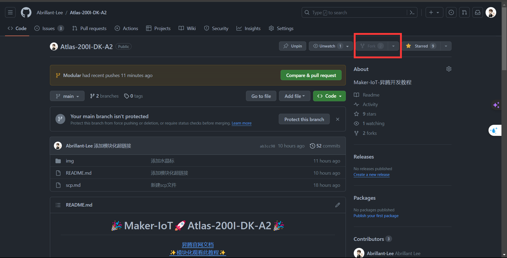
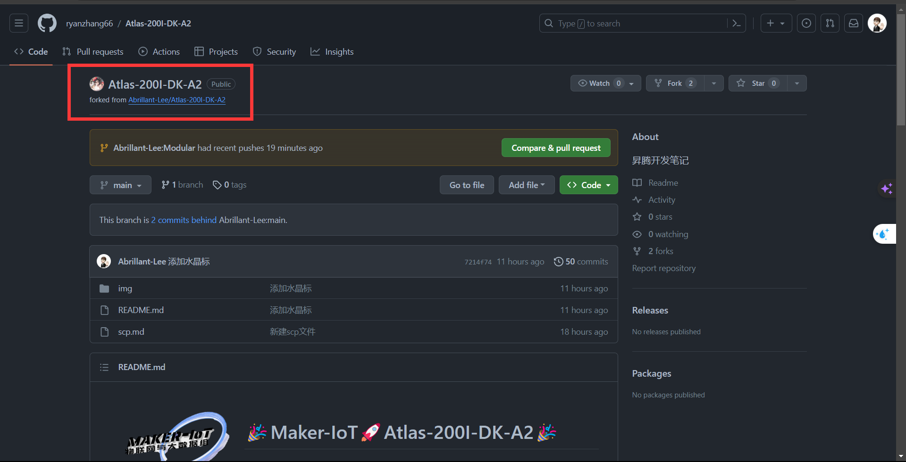
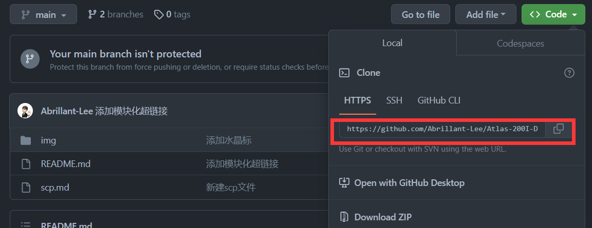
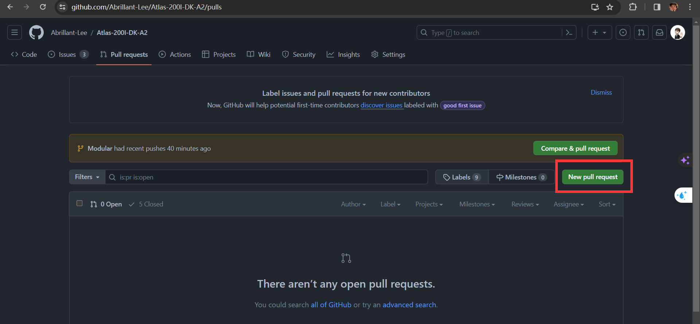

## Become a contributor🥳

### 1. 注册github账号
>进入github.com官网，点击右上角 Sign up按钮一顿猛操作就可以了，不多说了，相信你能搞定。
### 2. 对此 项目进行“派生（Fork）”
> 在 GitHub，“fork”指的是你自己的空间中创建的项目副本，这个副本允许你以一种更开放的方式对其进行修改。当你“派生”一个项目时，GitHub 会在你的空间中创建一个完全属于你的项目副本，且你对其具有推送权限。

   - 点击右上角fork按钮

        

   - fork成功后，自己的帐号下面就可以看到了

     


### 3. Clone 已经 fork 的项目
>当你 fork 一个项目之后，你需要把它克隆到你的电脑上，这样你才能开始工作。

要 clone 这个项目，你先打开你自己的 GitHub 主页，找到 fork 过来的项目，打开后点击右上角的 "Clone" 按钮，得到复制的地址。



### 4. 设置克隆过来的项目
>将原来项目的 URL 添加到你的本地代码仓库，这样你就可以随时从原来的项目 pull 最新的修改:
 ```
 git remote add upstream https://github.com/Abrillant-Lee/Atlas-200I-DK-A2.git
 ```

  这里用 upstream (上游) 作为远程仓库的名字，这是 GitHub 的风格，但是你可以用任何名字。

  现在的远程仓库是这个样子

  ```
  $ git remote -v
  origin https://github.com/your_username/Atlas-200I-DK-A2.git (fetch)
  origin https://github.com/your_username/Atlas-200I-DK-A2.git (push)
  upstream https://github.com/Abrillant-lee/Atlas-200I-DK-A2.git (fetch)
  upstream https://github.com/Abrillant-lee/Atlas-200I-DK-A2.git (push)
  ```

### 5. 开展工作
> 一顿猛如虎的操纵

### 6.  创建拉取请求 pull request
>当工作已经被推送到你的派生仓库后，你需要通知原项目的维护者你有想要他们合并的工作。 这通常被称作一个拉取请求（Pull Request），

- 点击创建request

    

- 下来是猛如虎的操作


## 🎉至此，欢迎成为此项目的贡献者 !!!🎉
---