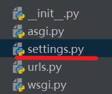
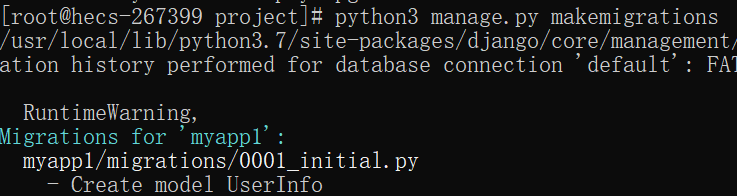
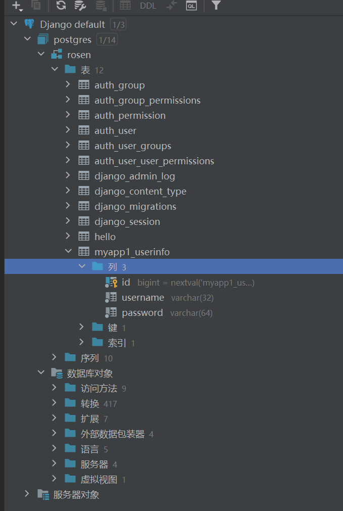
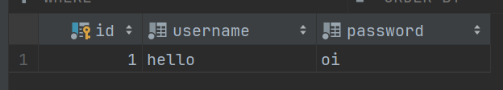
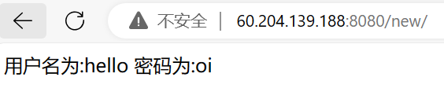

## 前提：django项目已经成功部署到服务器上
## 1  、django项目的配置
+ 进入django的配置文件setting中

+ 配置数据库文件
	找到数据库配置文件，把默认数据库换成opengauss数据库，高斯数据库属于postgres类型数据库，端口默认为5432
```python
DATABASES = {  
    'default': {  
        #加载opengauss数据库的驱动  
        'ENGINE': 'django.db.backends.postgresql_psycopg2',  
        #opengauss数据库名  
        'NAME': 'postgres',  
        #使用用户  
        'USER': 'rosen',  
        #密码  
        'PASSWORD': 'rosen@6664',  
        #服务器ip地址  
        'HOST': '60.204.139.188',  
        #端口  
        'PORT': '5432',  
    }  
}
```
## 2、创建数据库模型
+ 进入django模型中
	
+  创建数据库模型
	我就简单创建一个有账户和密码的用户模型
```python
from django.db import models  
class UserInfo(models.Model):  
    username=models.CharField(max_length=32)  
    password=models.CharField(max_length=64)
```
## 3、加载模型
+ 首先检测模型是否有改动
	python3 manage.py makemigrations
+ 输入后发生报错，构建psycopg2时缺少开发文件
+ 下载开发文件
	yum install postgresql-devel
	yum install python3-devel
+ 再次进行检测
	python3 manage.py makemigrations
	检测新创建一个模型，也就是一个表
	
+ 创建表
	python3 manage.py migrate
	成功创建
	
	在pycharm可以看到，表和django自带的表都已经成功创建!
	注意mysql的数据库图标和postgres的用户图标相同。这里rosen只是用户不是数据库，postgres才是数据库
	
## 4、进行测试
+ 往数据库添加一条数据
	
+ 在view中编写简单的查询django代码
```python
class S_new(APIView):  
    def get(self, request):  
        # 获取数据库数据  
        one = UserInfo.objects.first()  
        return HttpResponse("用户名为:"+one.username+ " 密码为:"+one.password)	
```
+ 在url里面配置访问api
```python
path("new/",views.S_new.as_view()),
```
+ 启动项目，进行实际测试
	python3 manage.py runserver 0.0.0.0:8080
	可以看到访问后，可以进行成功查询和展示
	