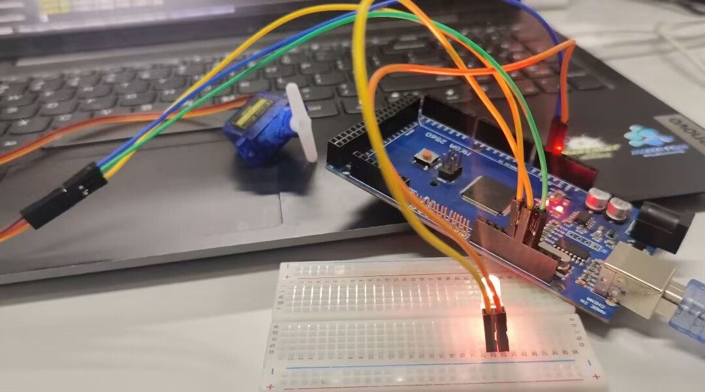

## 1、硬件连线

- 本教程需要的硬件为: Arduino、舵机、昇腾 <br>

- 利用mobaXterm继续远程连接

- 将使用USB线将昇腾与Arduino连接

- 连接实例:

    
  
- 验证连接

  ```bash
  #查看串口ttyUSB0
  ls/dev
  ```
  
### 数据通信
- 发送数据与QT结合发送命令

  ```python
  from PyQt5 import QtWidgets
  from light import Ui_MainWindow
  import sys
  import serial
  from PyQt5.QtWidgets import QApplication, QMainWindow, QWidget, QFileDialog, QMessageBox
  import light
  port = '/dev/ttyUSB0'  # 根据你的连接方式和串口号进行修改
  baudrate = 9600
  ser = serial.Serial(port, baudrate)


  class cc(light.Ui_MainWindow,QMainWindow):
    def __init__(self):
        super(light.Ui_MainWindow, self).__init__()
        self.setupUi(self)  # 创建窗体对象
        self.init()

    def init(self):
        self.pushButton.clicked.connect(self.Light)
        self.pushButton_2.clicked.connect(self.nolight)
        self.pushButton_3.clicked.connect(self.duoji)

    def Light(self):
        data = 1
        ser.write(str(data).encode())

    def nolight(self):
        data1 = 2
        ser.write(str(data1).encode())

    def duoji(self):
        data2 = 3
        ser.write(str(data2).encode())

    def closeEvent(self, event):
        ser.close()
        event.accept()

  if __name__ == '__main__':

    from PyQt5 import QtCore

    QtCore.QCoreApplication.setAttribute(QtCore.Qt.AA_EnableHighDpiScaling)  # 自适应分辨率

    app = QtWidgets.QApplication(sys.argv)
    ui = cc()
    ui.show()
    sys.exit(app.exec_())
  ```
- 接收数据数据响应

  ```python
  const int ledPin = 13;// 将 LED 连接到 Arduino 的 13 号引脚
  #include <Servo.h>
  Servo my;

  void setup() {
    Serial.begin(9600);  // 初始化串口通信，波特率设置为 9600
    pinMode(ledPin, OUTPUT);
    my.attach(12);// 将 LED 引脚设置为输出模式
  }

  void loop() {
    if (Serial.available()) {
      byte data = Serial.read();  // 读取串口输入的整数数据
    
      if (data == '1') {
        digitalWrite(ledPin, HIGH); 
        delay(100);// 点亮 LED
      } 
      else if (data == '2') {
        digitalWrite(ledPin, LOW); 
        delay(100);// 关闭 LED
      }
      else if(data == '3')
      {
        for(int r=100;r>=10;r=r-10)
    
      my.write(r);
      delay(100);
        }}
    }
  }
  ```
  
- 安装PyQt5
  ```bash
  #安装PyQt5（确保可以使用pip）
  pip install PyQt5==5.9.2
  ```
### 视频演示

  
