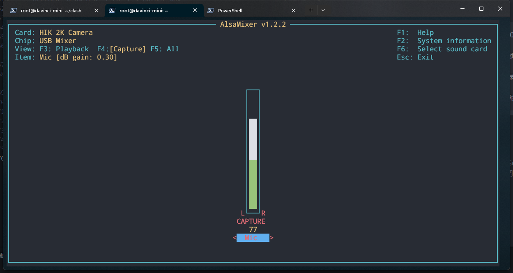

## 1、硬件接线

- 本教程采用的麦克风设备为： HIK 2K Camera（海康威视）<br>
- 本教程采用的音频输出设备为：无<br>

- 将USB麦克风接入开发者套件任意一个空闲USB接口（USB 3.0 Type A）。

- 连接示例：

    

- 验证连接

  ```bash
  #查看usb设备
  lsusb

  #连接成功示例
  Bus 003 Device 003: ID 2bdf:028a SN0002 HIK 2K Camera
  ```

- 检测音频录音设备是否正常工作

  ```bash
  arecord -l

  //示例输出
  **** List of CAPTURE Hardware Devices ****
  card 0: Camera [HIK 2K Camera], device 0: USB Audio [USB Audio]
    Subdevices: 1/1
    Subdevice #0: subdevice #0
  ```

## 2、录音

### 方式一：使用arecord录制音频
>arecord 是 ALSA（Advanced Linux Sound Architecture）的一个命令行工具，用于录制音频。

- 常用的 arecord 命令选项

  -   -D：指定音频设备。例如，-D hw:1,0 指定卡号为1，设备号为0的硬件设备。

  -  -f：指定音频格式。例如，-f cd 指定CD质量的音频（44100Hz，16位，立体声）。

  -  -d：指定录音时间，单位为秒。例如，-d 10 指定录音10秒。

  -  -c：指定声道数。例如，-c 1 指定单声道录音。

  -  -r：指定采样率。例如，-r 48000 指定48000Hz的采样率。

  -  -t：指定文件类型。例如，-t wav 指定WAV格式的文件。

  -  -v：打开音量指示。

  -  -l：列出所有的录音设备。

- 录制音频

    ```bash
    //从指定的音频设备录制音频，并将录制的音频保存为 WAV 格式的文件
    arecord -D hw:0,0 -f cd -c 1 output.wav
    ```

- 命令详解
    ```bash
    -D hw:0,0：这个参数指定了音频设备。hw:0,0 表示卡号为 0，设备号为 0 的硬件设备。

    -f cd：这个参数指定了音频格式。cd 是一个预设的格式，表示 CD 质量的音频（44100Hz，16位，立体声）。

    -c 1：这个参数指定了声道数。1 表示单声道录音。

    output.wav：这是输出文件的名称。录制的音频将被保存为这个文件
    ```

## 3、设置音量
>alsamixer 是 Linux 系统中 ALSA(Advanced Linux Sound Architecture) 音频框架的一个图形化混音器。它允许你在终端中以图形化的方式调整音频设备的音量和设置。

- 基本使用

    - 打开 alsamixer：在终端中输入 alsamixer，然后按回车键。

    - 选择不同的音频设备：使用 F6 键，然后在弹出的列表中选择你想要调整的音频设备。

    - 调整音量：使用上下箭头键来增加或减少选定的音频通道的音量。

    - 切换静音/非静音：使用 M 键来切换选定的音频通道的静音状态。

    - 选择不同的音频通道：使用左右箭头键来在不同的音频通道之间切换。

    - 退出 alsamixer：使用 Esc 键退出 alsamixer。

- 示例

    

## 4、播放音频
>aplay 是 ALSA（Advanced Linux Sound Architecture）的一个命令行工具，用于播放音频

- 常用选项

    - -D：指定音频设备。例如，-D hw:1,0 指定卡号为1，设备号为0的硬件设备。

    - -f：指定音频格式。例如，-f cd 指定CD质量的音频（44100Hz，16位，立体声）。

    - -c：指定声道数。例如，-c 1 指定单声道播放。

    - -r：指定采样率。例如，-r 48000 指定48000Hz的采样率。

    - -t：指定文件类型。例如，-t wav 指定WAV格式的文件。

    - -v：打开音量指示。

    - -l：列出所有的播放设备。
