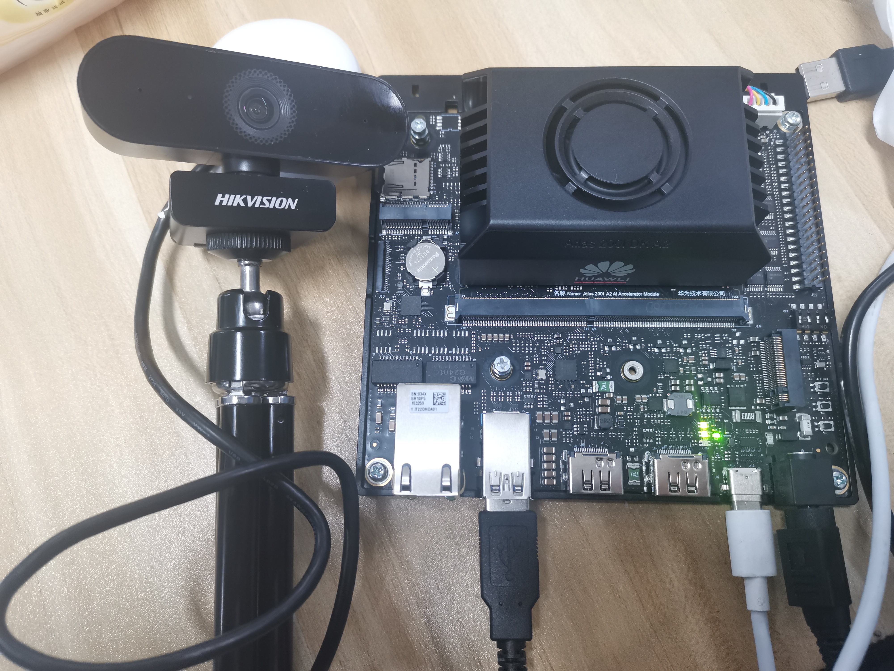

## 1、硬件接线

- 本教程采用的摄像头为： HIK 2K Camera（海康威视）<br>

- 将USB摄像头接入开发者套件任意一个空闲USB接口（USB 3.0 Type A）。

- 连接示例：

    


## 2、拍照

### 方式一：使用 ffmpeg 从摄像头捕获一张图片

- 拍照命令

    ```bash
    ffmpeg -f v4l2 -video_size 640x480 -i /dev/video0 -vframes 1 output.jpg
    ```

- 命令详解

    - -f v4l2：设置输入格式为 Video4Linux2，这是 Linux 上用于处理视频流的框架。
    - -video_size 640x480：设置视频分辨率为 640x480。
    - -i /dev/video0：输入设备是 /dev/video0，这通常是第一个摄像头设备。
    - -vframes 1：只输出一帧，即一张图片。
    - output.jpg：输出文件是 output.jpg。

- 查看图片

    ```bash
    #安装 ImageMagick 和 ImageMagick-devel 包
    yum install -y ImageMagick ImageMagick-devel

    #显示图像
    dispaly output.jpg
    ```

- 演示视频

  

## 3、录制视频

### 方式一：使用 ffmpeg 录制视频

- 录制视频命令

    ```bash
    ffmpeg -f v4l2 -s 640x480 -i /dev/video0 -t 10 output.mp4
    ```

- 命令详解
    - -f v4l2：设置输入格式为 Video4Linux2。
    - -s 640x480：设置视频分辨率为 640x480。
    - -i /dev/video0：输入设备是 /dev/video0。
    - -t 10：录制时间为10s
    - output.mp4：输出文件是 output.mp4。

- 播放视频

    ```bash
    ffplay output.mp4
    ```

- 演示视频

    


