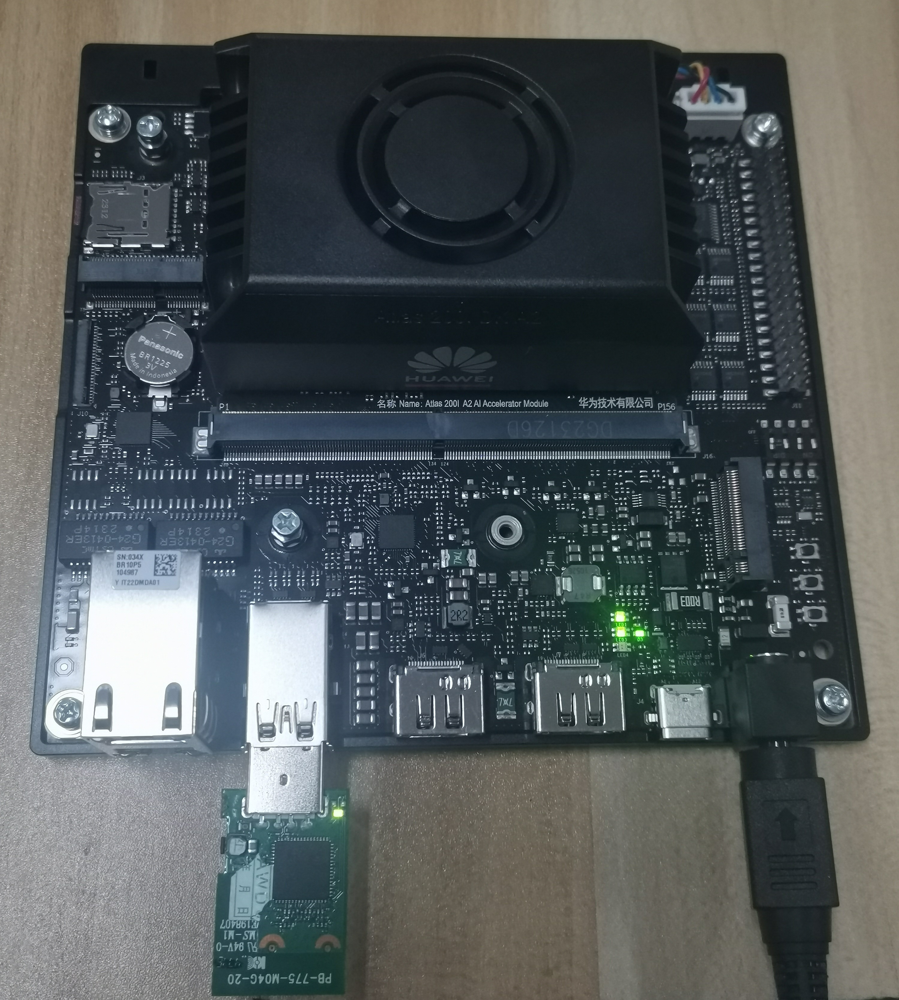
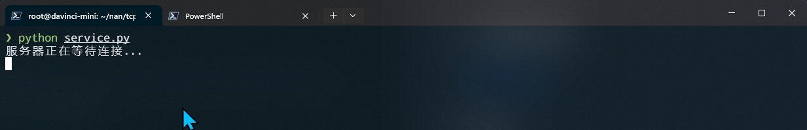
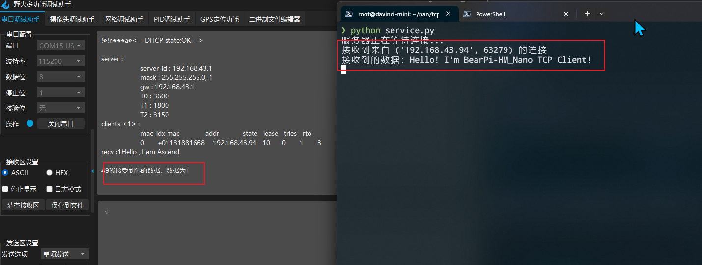

<div align="center">

## 昇腾和小熊派网络Socket通信

</div>

本文档介绍如何使用昇腾和小熊派进行网络Socket通信，程序可以直接使用。如果你对网络编程不熟悉，推荐你学习[《TCP/IP网络编程》](https://github.com/riba2534/TCP-IP-NetworkNote)。

## 一、所需硬件

进行网络Socket通信，你需要准备以下硬件：

- 昇腾
- 小熊派
- [USB WiFi网卡](https://www.hiascend.com/document/detail/zh/Atlas200IDKA2DeveloperKit/23.0.RC1/Hardware%20Interfaces/hiug/hiug_0059.html)

下图展示了硬件的接线方式：

<div align="center">
  
</div>

## 二、网络编程程序

以下是我们将使用的网络Socket通信程序：

- [昇腾服务端程序](./socket/server.py)
- [小熊派客户端程序](./socket/client.c)

## 三、通信过程

通信过程如下：

1. 运行昇腾服务端程序：

    ```bash
    python3 server.py
    ```

    运行结果如下：

    <div align="center">
      
    </div>

2. 烧录小熊派代码，然后使用串口调试器打开串口，查看打印信息。

    结果如下：

    <div align="center">
      
    </div>
