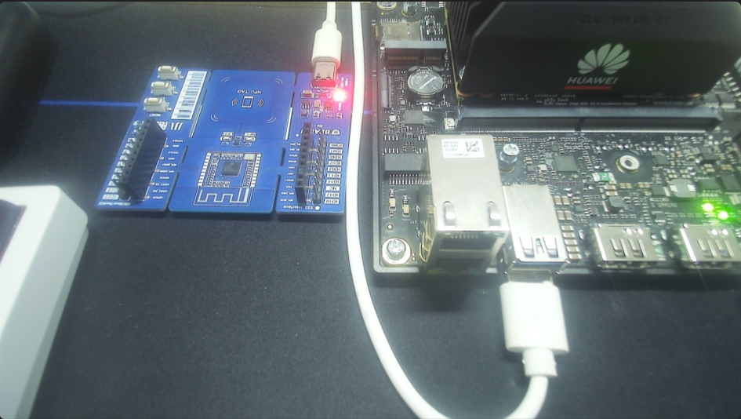
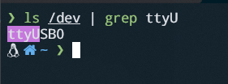
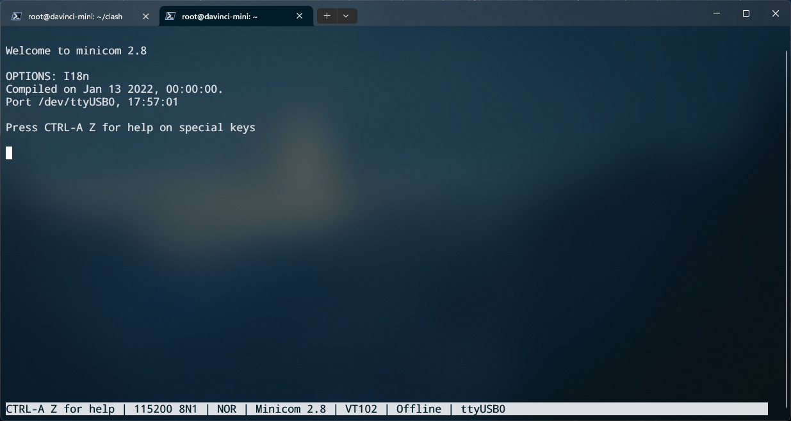
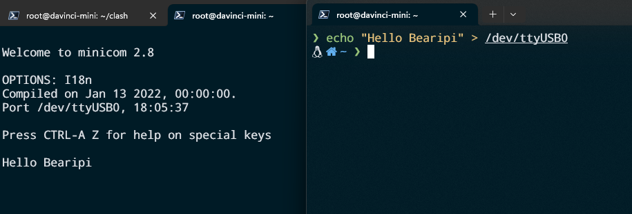
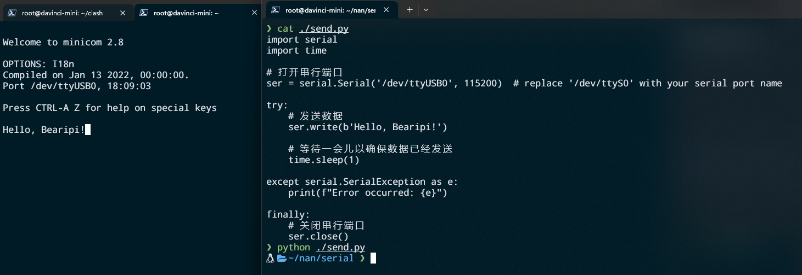

## 昇腾和小熊派串口通信

### 1、硬件连接
> 使用type-c连接Bearipi和昇腾


### 2、检查串口设备
>USB0作为串口时，对应的串口号为“/dev/ttyUSB0”。
- 执行命令查看终端设备

    ```bash
    ls /dev | grep ttyUSB0
    ```

- 成功示例

    

### 3、Hi3861串口接发程序
>根据目前测试来看，小熊派串口自带接发程序

### 4、昇腾串口发送数据
>昇腾向小熊派发送数据，小熊派返回原数据

#### 1.使用minicom 连接串口设备
>具体使用看玩转串口这一章节

  ```bash
  minicom -D /dev/ttyUSB0
  ```
   - 成功示例

     


#### 2.发送数据验证是否接收
>打开另一个终端进行ssh连接昇腾

- 1、直接使用命令

  ```bash
  echo "Hello Bearipi" > /dev/ttyUSB0
  ```
  -   成功示例

    

- 2、使用pyserial库

    

### 视频演示

  
