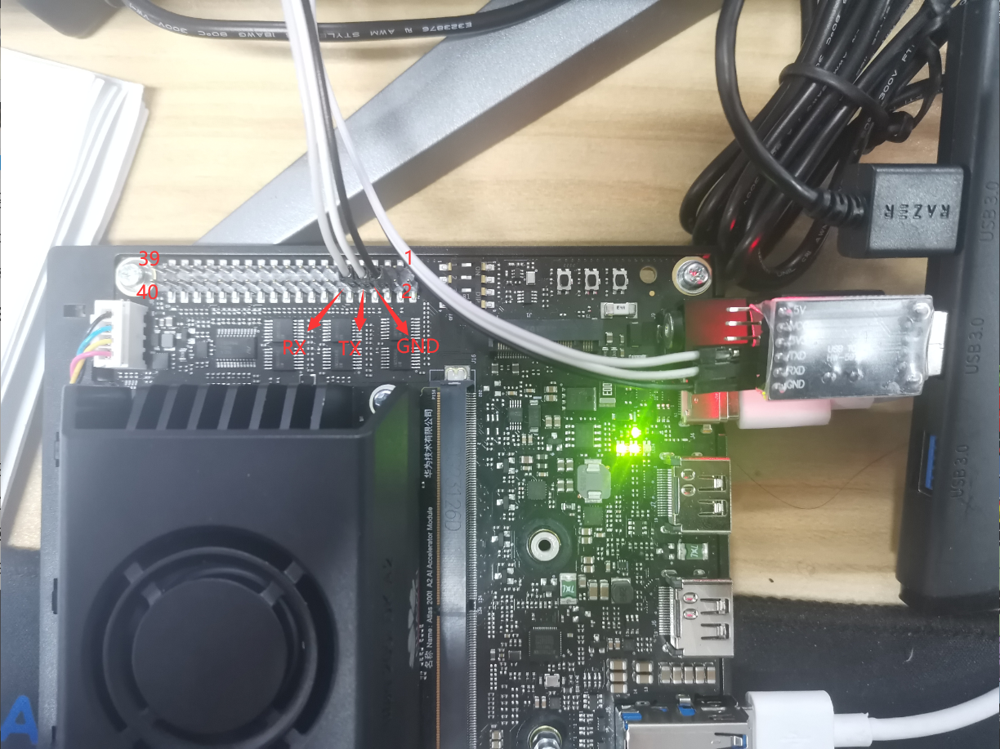
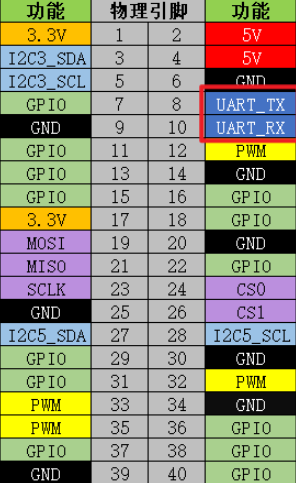
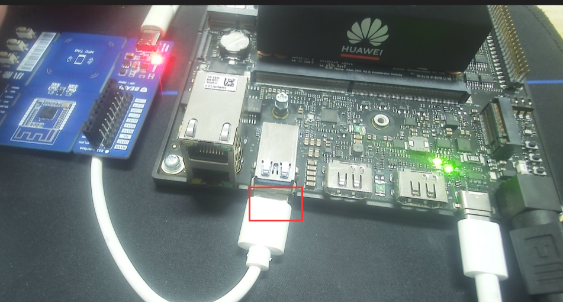

# 玩转昇腾串口🗽

### 1、昇腾串口资源

- UART0串口硬件接线
  >开发者套件的40Pin接口上默认串口为引脚8（UART0_TX）、10（UART0_RX），对应的串口号为“/dev/ttyAMA0”。

  
  <a href="https://www.hiascend.com/document/detail/zh/Atlas200IDKA2DeveloperKit/23.0.RC2/Hardware%20Interfaces/hiug/hiug_0017.html">
    
  </a>

- USB0串口硬件接线
  >也可连接USB0作为串口，对应的串口号为“ /dev/ttyUSB0”。

  


## 2、串口通讯实验
>本实验中，我们的重点是使用前面Python库，来调用板卡上的串口资源。硬件上，通过板卡与USB转TTL模块连接到我们的电脑上， 并通过串口上位机来进行实验现象的演示和操作。

### 方式一：使用pySerial库
>官方文档链接：https://pythonhosted.org/pyserial/

- 简介

  PySerial是一个Python库，用于与通过串行端口的硬件进行通信。它提供了一种简单的方式来读取和写入数据，支持多种串行协议。

-  安装

    ```bash
    # 在板卡使用如下命令安装
    pip install pyserial
    ```

### 数据接收

- 发送数据

  ```python
  import serial

  # 创建一个串行端口对象
  ser = serial.Serial('/dev/ttyUSB0', 9600)

  # 要发送的数据
  data = 'Hello, Ascend!'

  # 发送数据
  ser.write(data.encode())

  # 关闭串行端口
  ser.close()
  ```

- 接收数据

  ```python
  import serial

  # 创建一个串行端口对象
  ser = serial.Serial('/dev/ttyUSB0', 9600)

  while True:
      # 读取一行数据
      line = ser.readline()

      # 打印读取的数据
      print(line)
  ```

- 综合测试

  ```python
  """ pyserial uart 测试 """
  import serial

  # 打开uart0，设置串口波特率为115200，数据位为8，无校验位，停止位为1，不使用流控制，以非阻塞模式打开串口，等待时间为3s
  with serial.Serial(
      "/dev/ttyAMA0",
      baudrate=115200,
      bytesize=serial.EIGHTBITS,
      stopbits=serial.STOPBITS_ONE,
      parity=serial.PARITY_NONE,
      timeout=3,
  ) as uart3:
      # 使用申请的串口发送字节流数据 "Hello World!\n"
      uart3.write(b"Hello Ascend!\n")

      # 以非阻塞的方式打开的串口，在读取串口接收的数据时，该函数返回条件二者满足其一，一、读取到128个字节，二、读取时间超过1秒
      buf = uart3.read(128)

      # 注：Python读取出来的数据类型为：bytes
      # 打印原始数据
      print("原始数据:\n", buf)
      # 转码为gbk字符串，可以显示中文
      data_strings = buf.decode("gbk")
      # 打印读取的数据量及数据内容
      print("读取到 {:d} 个字节 , 以字符串形式打印:\n {:s}".format(len(buf), data_strings))
  ```

### 方式二：直接使用命令：

- 发送数据

  ```bash
  #使用echo命令向终端设备文件写入字符串"Hello Ascend!"

  echo "Hello Ascend!" > /dev/ttyAMA0

  #Windows上的串口调试助手会接收到内容
  ```

- 读取数据

  ```bash
  #使用cat命令读取终端设备文件
  cat /dev/ttyAMA0
  #cat命令会等待
  #使用串口调试助手发送字符串
  #字符串最后必须加回车！
  #板卡的终端会输出接收到的内容
  ```


### 方式三：使用串口工具: minicom通讯

- 安装minicom

  ```bash
  #安装minicom软件包
  sudo yum install minicom
  ```

- 使用 minicom打开昇腾串口进行使用

  ```bash
  minicom -D '/dev/ttyAMA0'
  ```

- minicom基本操作
>进入minicom界面后，需使用Ctrl+a 进入设置状态

  | 键  | 功能描述 |
  | --- | --- |
  | Z键 | 进入设置菜单 |
  | O键 | 打开配置选项 |
  | W键 | 自动卷屏。当显示的内容超过一行之后，自动将后面的内容换行。这个功能在查看内核的启动信息时很有用 |
  | C键 | 清除屏幕的显示内容 |
  | B键 | 浏览minicom的历史显示 |
  | X键 | 退出minicom，会提示确认退出 |
