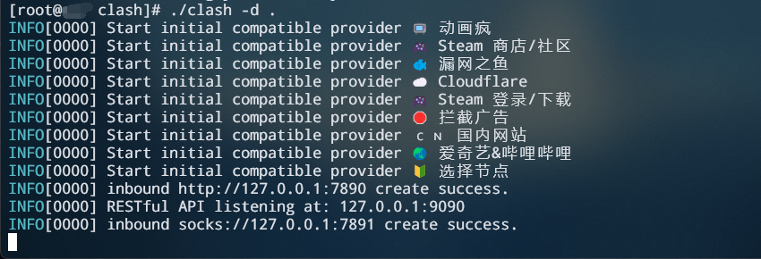
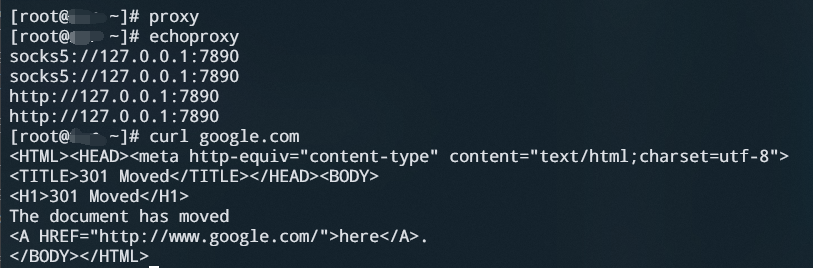

### 1、Clash代理🚀🚀🚀

> 在某些情况下，你可能需要配置代理来访问互联网。下面所有的配置都是在有代理的环境下进行，可以提高数百倍下载速度，尽量完成这一步，来提高开发效率。

<details><summary>🚀下载Clash内核</summary>

- 查看Linux系统版本

  ```sh
  uname -a
  ```

- [选择对应的clash内核下载](https://www.clash.la/archives/755/) (点击即可)

- 使用scp将内核文件复制到远程昇腾

  ```
  # 语法
  scp SourceFile user@host:directory/TargetFile

  # 示例
  scp ./clash-linux-amd64-v1.18.0.gz  root@10.10.0.2:/root
  ```

- [***补充:scp命令详解***](../../ssh/scp.md)
>scp是 SSH 提供的一个客户端程序，用来在两台主机之间加密传送文件（即复制文件）,不了解scp命令的点击进去仔细观看，后续所有远程传输文件皆使用给scp命令进行


</details>
<details><summary>🚀启动Clash</summary>

- 在用户目录下创建 clash 文件夹

  ```
  cd && mkdir clash
  ```

- 移动并解压clash内核文件,并添加执行权限

  ```
  # 解压内核文件
  tar -xvf ./clash-linux-amd64-v1.18.0.gz

  # 重命名内核文件
  mv ./clash-linux-arm64 clash

  # 移动到clash执行文件到clash文件夹内
  mv ../root/clash ./clash
  ```

- 下载 Clash 配置文件

  ```
  # 这是个示例，请用自己的购买代理的url
  wget -O config.yaml "https://bl7gc.no-mad-world.club/link/EXxV5spf9gJDYri6?clash=x"
  ```

- Start Clash!
  ```
  ./clash -d .
  ```

- 运行成功示例

  

</details>

<details><summary>🚀配置Linux代理</summary>

- 编辑 ~/.bashrc

  ```
  vim ~/.bashrc
  ```

- 在最底部加上如下内容，一键配置代理
  ```
  # 获取默认路由的IP地址，并将其赋值给变量hostip，可直接赋值为"127.0.0.1"
  export hostip=$(ip route | grep default | awk '{print $3}')
  export socks_hostport=7890
  export http_hostport=7890
  alias proxy='
      export https_proxy="http://${hostip}:${http_hostport}"
      export http_proxy="http://${hostip}:${http_hostport}"
      export ALL_PROXY="socks5://${hostip}:${socks_hostport}"
      export all_proxy="socks5://${hostip}:${socks_hostport}"
  '
  alias unproxy='
      unset ALL_PROXY
      unset https_proxy
      unset http_proxy
      unset all_proxy
  '
  alias echoproxy='
      echo $ALL_PROXY
      echo $all_proxy
      echo $https_proxy
      echo $http_proxy
  '
  #end proxy
  ```
- 注意：使用网卡连接WIFI，可能会出现本机IP地址获取不对的情况，导致访问不了外部网络
   >可以将 `export hostip=$(ip route | grep default | awk '{print $3}')` 替换成`127.0.0.1`
   ```
   export hostip=127.0.0.1
   ```

</details>

<details><summary>🚀配置完之后如何使用</summary>

- 打开一个终端进入昇腾开发环境，执行clash文件

  ```
  ./clash/clash -d .
  ```
- 执行成功截图
  

- 打开另一终端再次进入昇腾开发环境，配置系统代理

  ```
  # 执行脚本，配置代理
  proxy

  # 查看代理是否配置成功
  echoproxy

  ```
- 验证代理是否配置成功

  ```
  # 向google.com发送一个HTTP GET请求
  curl google.com
  ```

- 配置成功截图

  

</details>

